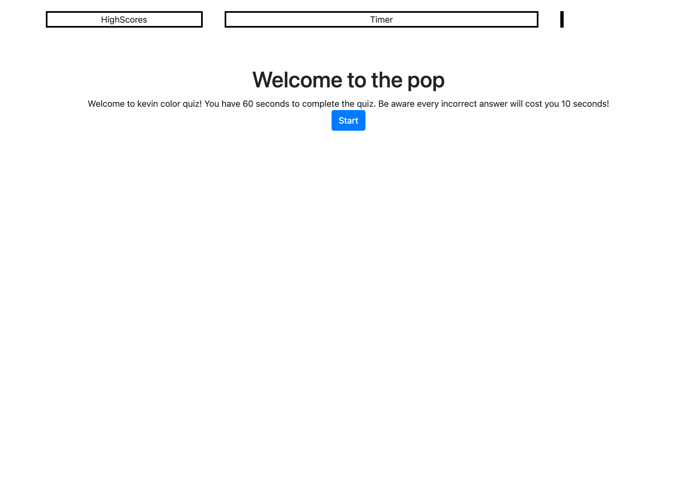

# PopQuiz README

## Description
This project required the creation PopQuiz appliaction that is timed coding quiz with multiple-choice questions

## Installation
To deploy the website please upload the folder to a internet server to allow user accessiblity.

## Usage
This site will used as the main site for my quiz.

## Portfolio Notes
This portfolio will be consently updated with new work as I progress through the course

## Files & directories
Directories 
* assets
* css
* images

## Deployed Project
Repo
* [Pop Quiz](https://drkevinfriday.github.io/Popquiz/)

## Full Page

## License
Mit

## Contributing
Kevin Friday

## Credits
Made by Kevin J Friday
